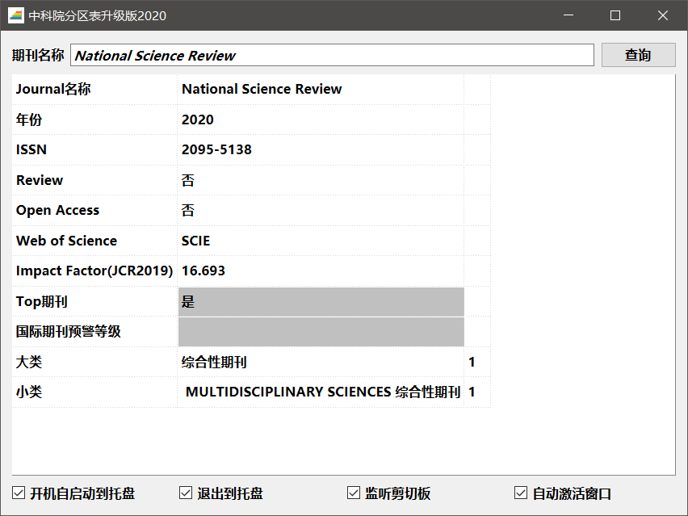
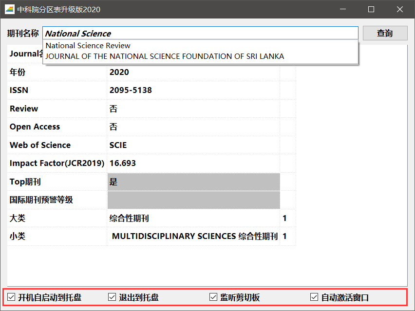

# ShowJCR

## 前言

科研成果经常以发表不同层次的国际学术期刊为体现，因此评价国际学术期刊影响力至关重要。中国科研人员常用的期刊评价标准包括JCR（[Journal Citation Reports](https://jcr.clarivate.com/)）和中科院分区表（[中国科学院文献情报中心期刊分区表](http://www.fenqubiao.com/)）等。中科院分区表在2019年试行升级版，并在2019-2021的3年过渡期同时发布基础版和升级版，便于用户单位过渡、调整。自2022年开始，将只发布升级版。因此，中科院分区表升级版已经越来越成为科研人员选择学术期刊的重要依据。

中科院分区表升级版设计了“期刊超越指数”取代JCR中的期刊影响因子（Impact Factor）指标，有时候不便于直接获取期刊的影响因子。

此外，中科院分区表于2020年12月31日发布[《国际期刊预警名单（试行）》](https://mp.weixin.qq.com/s/xbyJFtR2lezv6CyRrkxsdA)，该名单没有体现在升级版中。

针对上述需求，为了科研人员更方便直观的获取国际学术期刊影响力评价，因此在2020年中科院分区表升级版的基础之上，补充展示了期刊影响因子和国际期刊预警等级。

## 数据来源

中科院分区表升级版数据来源于[advanced.fenqubiao.com](http://advanced.fenqubiao.com)，通过爬虫获取，信息包括期刊是否为Review、是否为Open Access、Web of Science收录类型（分为SCI、SCIE、SSCI、ESCI等）、是否为Top期刊、大类分区信息、（一至多个）小类分区信息。

JCR期刊影响因子来源于[https://jcr.clarivate.com](https://jcr.clarivate.com)，直接下载完整的JCR报告获取，但该报告不包含JCR分区信息，暂时还没有实现对JCR分区信息的爬虫，欢迎有能力的开发者参与或分享！（注：极少部分期刊没有JCR影响因子）

国际期刊预警等级来源于[《国际期刊预警名单（试行）》](https://mp.weixin.qq.com/s/xbyJFtR2lezv6CyRrkxsdA)，处理时删去了期刊的大类学科分区信息。

中国计算机学会（CCF）[推荐国际学术会议和期刊目录](https://www.ccf.org.cn/Academic_Evaluation/By_category/)，[推荐中文科技期刊目录](https://www.ccf.org.cn/ccftjgjxskwml/)。

### SQLite3数据库生成步骤

国际期刊信息的原始数据随附在源代码中。

SQLite3创建"jcr.db"并进入到SQLite命令行：

```sqlite
sqlite3 jcr.db
```

在SQLite命令行中，将原始数据导入到"jcr.db"：

```sqlite
.separator ','	#设置','为数据分隔符，否则导入csv数据时sqlite无法区分列
.import FQBJCR2020-UTF8.csv fqb
.import JCR2019.csv jcr
.import Warning.csv warning
.import CCF2019-UTF8.csv ccf
.import CCFChinese2019-UTF8.csv ccfchinese
.import JCR2019extend-UTF8.csv jcrextend
```

## 运行依赖

1. **jcr-logo.jpg**，用于系统托盘图标；
3. **jcr.db**，期刊信息数据库；
3. Qt相关依赖（使用windeployqt自动生成后可以裁剪）。

## 使用说明

软件的使用十分方便，如图所示，输入期刊名称，点击“查询”或输入“回车”即可获得期刊详细信息。“Top期刊”和“国际期刊预警等级”属性进行突出显示。



期刊名称输入时具备联想功能，并且不区分大小写。



如上图中红框所示，软件还具有4个属性选项：

1. 开机自启动到托盘；
2. 退出到托盘；
3. 监听剪切板：在后台监听剪切板，如果复制文字为期刊名称，将自动进行查询；
4. 自动激活窗口：与监听剪切板配合使用，当监听到期刊名称并自动查询完成后，将窗口显示到桌面最前。

